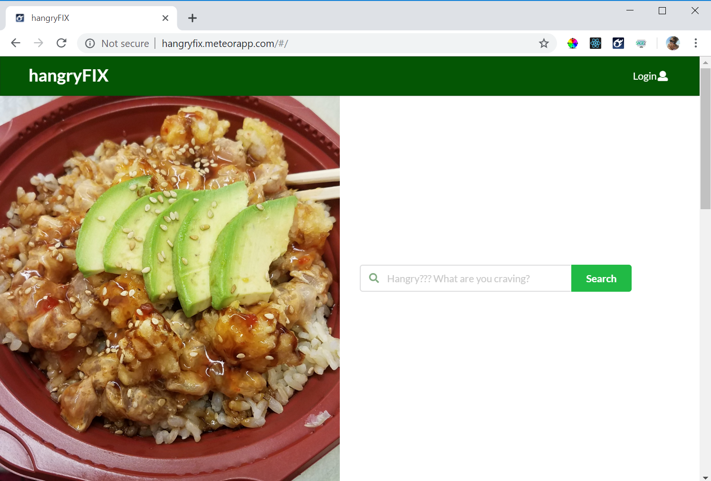
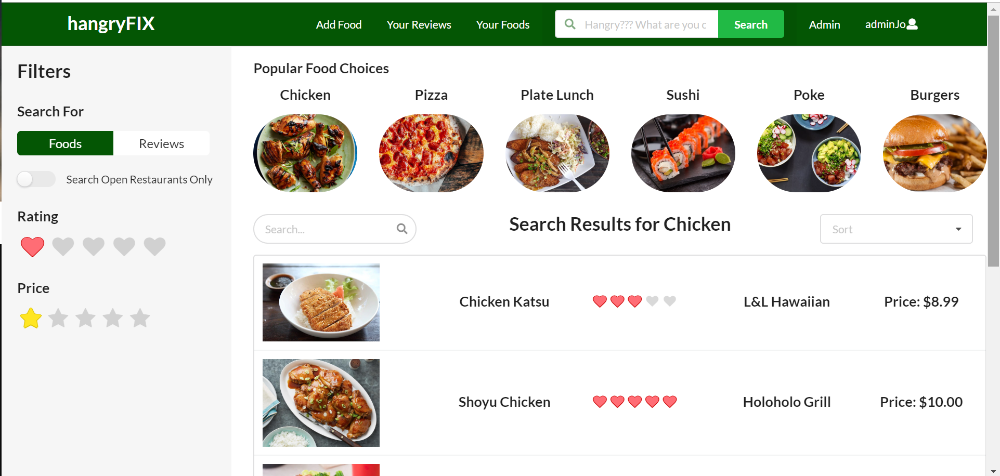
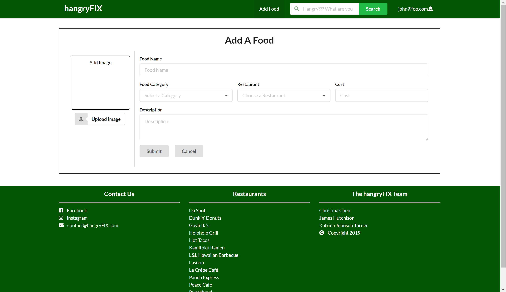
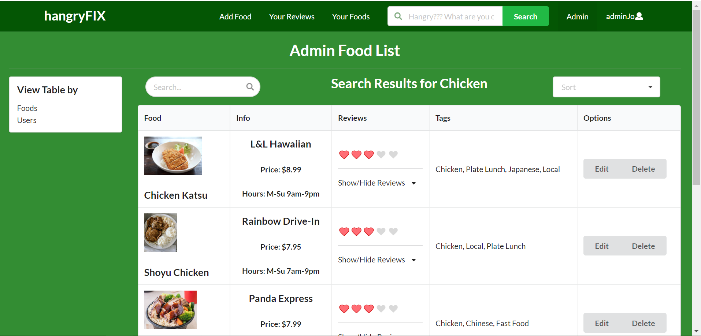

<h2>Overview</h2>

There are many restaurant review sites (i.e. Yelp), but students often crave a specific food item rather than a genre or restaurant.
 

Hangry Fix is a way for UHM students to publicize, rate, and search for specific food items. Ratings will revolve around food items rather than overall restaurant quality, service, etc.

Users can also allow email and SMS notifications on their account on new locations for selected foods.

<h2>The App</h2>

<h3>Landing Page</h3>

The landing page will displays recent food items and their ratings, and it will also explain the purpose and mission of the site.  To prevent hangryness. Users can log in, register, and do a quick search of the foods or reviews.

<button color="#5BBB5B" href="http://hangryfix.meteorapp.com/#/">Go to page</button>
 

<h3>Sign Up Page</h3>

Before users can add foods or leave reviews, they must create an account.  They can add tags associated with their favorite foods.

<button color="#5BBB5B" href="http://hangryfix.meteorapp.com/#/signup">Go to page</button>
 

<h3>User HomePage</h3>

Users have a personalized page that contains user specific data.  They can view their recent searches, foods that they have added to the database, as well as edit & delete previous reviews.  Students can select their favorite types of foods and can see suggestions for new reviews or foods that are connected to a category that they have favorited.

<button color="#5BBB5B" href="http://hangryfix.meteorapp.com/#/yourfoods">Go to page</button>
 

<h3>Search Page</h3>

The search page is one of the most important pages in the application.  From here, users can find foods that they like, or search for what restaurants are currently open.  They are able to sort their results in useful ways, such as by rating, by food type, or by restaurant.

<button color="#5BBB5B" href="http://hangryfix.meteorapp.com/#/search">Go to page</button>
 

<h3>Add Food Page</h3>

All users with an account can add a new food item to the database.  The food is linked to a restaurant, so that when it is searched for, the open hours and address are easily accessable.

<button color="#5BBB5B" href="http://hangryfix.meteorapp.com/#/addfood">Go to page</button>
 

<h3>Adding/Editing Reviews</h3>

Users can add a review for a food item they have eaten before if that has already been added to the database. (Otherwise they need to first add the food).  They can also go back and edit that review at anytime.

<h3>Admin Page</h3>

Admin would be able to see all posts and have the rights to delete anything they deem inappropriate.

<button color="#5BBB5B" href="http://hangryfix.meteorapp.com/#/admin">Go to page</button>
 

<h2>The Authors</h2>

Christina Chen James Hutchison Katrina Johnson Turner

<button href="https://github.com/hangryfix/hangryfix/projects">Go to Project Board</button>
