<h2>Table of Contents</h2>
- <a href="#overview">Overview</a>
- <a href="#theApp">The App</a>
  - <a href="#landingPage">Landing Page</a>
  - <a href="#signUpPage">Sign Up Page</a>
  - <a href="#userHomePage">User Home Page</a>
  - <a href="#searchPage">Search Page</a>
  - <a href="#addFoodPage">Add Food Page</a>
  - <a href="#addingEditingReviews">Adding/Editing Reviews</a>
- <a href="#installation">Installation</a>
- <a href="#developmentHistory">Development History</a>
  - <a href="#milestone1">Milestone 1: Mockup development</a>
  - <a href="#milestone2">Milestone 2: Functionality</a>
  - <a href="#milestone3">Milestone 3: Improved functionality</a> 
- <a href="#theAuthors">The Authors</a>

<h2 id="overview">Overview</h2>

There are many restaurant review sites (i.e. Yelp), but students often crave a specific food item rather than a genre or restaurant.
 

hangryFIX is a way for UHM students to publicize, rate, and search for specific food items. Ratings will revolve around food items rather than overall restaurant quality, service, etc.

Users can also allow email and SMS notifications on their account on new locations for selected foods.

<a href="http://hangryfix.meteorapp.com/#/"><button>Go to App</button></a>
<a href="https://github.com/hangryfix/hangryfix/projects"><button>Go to Project Board</button></a>
<a href="https://github.com/hangryfix/hangryfix"><button>Go to Source Code</button></a>

 
   

<h2 id="theApp">User Guide</h2>

<h3 id="landingPage">Landing Page</h3>

The landing page will displays recent food items and their ratings, and it will also explain the purpose and mission of the site.  To prevent hangryness. Users can log in, register, and do a quick search of the foods or reviews.

<a href="http://hangryfix.meteorapp.com/#/"><button>Go to page</button></a>
 

<h3 id="signUpPage">Register Page</h3>
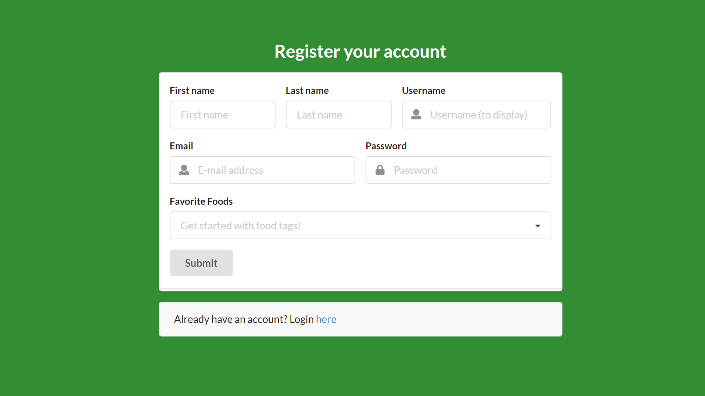

Before users can add foods or leave reviews, they must create an account.  They can add tags associated with their favorite foods.

<a href="http://hangryfix.meteorapp.com/#/signup"><button>Go to page</button></a>
 

<h3 id="userHomePage">Your Account Page</h3>
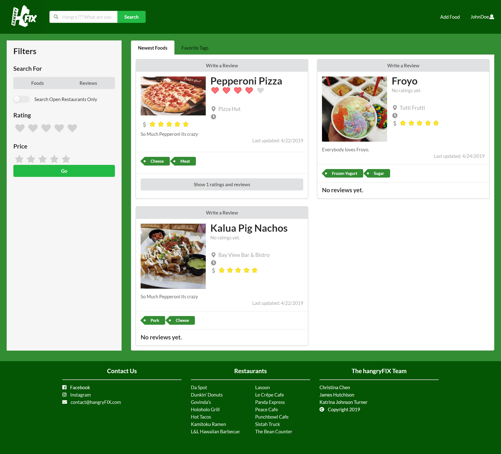

Users have a personalized page that contains their foods marked by tags they favorited and foods that have been recently added to the app. Users have a personalized page that contains user specific data.

<a href="http://hangryfix.meteorapp.com/#/yourAccount"><button>Go to page</button></a>
 

<h3 id="searchPage">Search Page</h3>
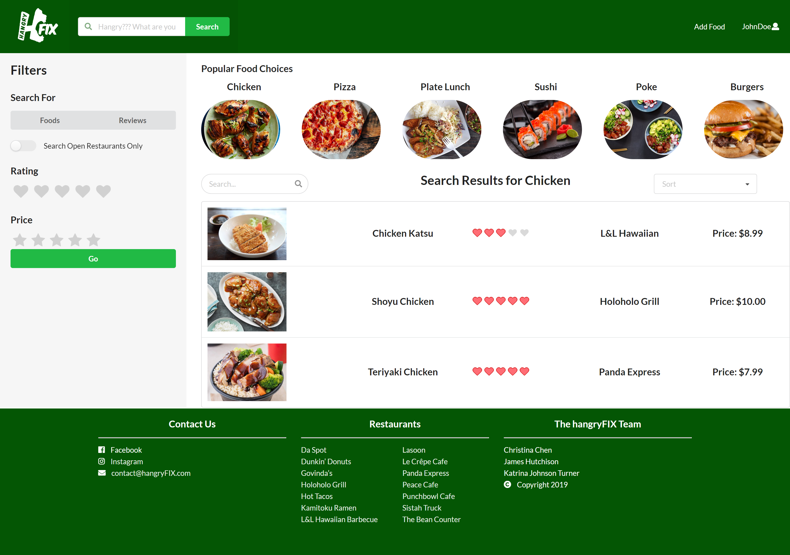

The search page is one of the most important pages in the application.  From here, users can find foods that have been added to the app based on their food categories. 

<a href="http://hangryfix.meteorapp.com/#/search"><button>Go to page</button></a>
 

<h3 id="addFoodPage">Add Food Page</h3>
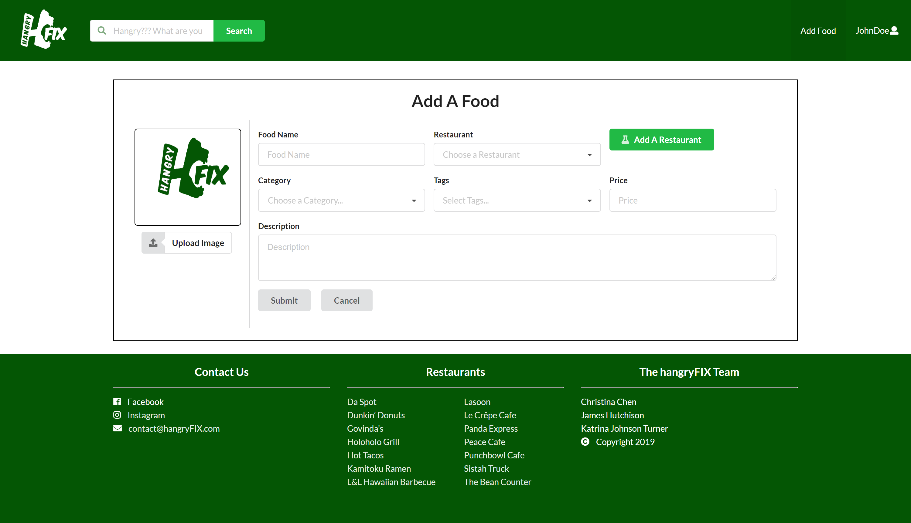

All users with an account can add a new food item to the database. Available information the user can add about that food is name, image by URL, restaurant and its hours, the magnitude of its price, and a brief description. Users can also add new restaurants if they aren't available.

<a href="http://hangryfix.meteorapp.com/#/addFood"><button>Go to page</button></a>
 

<h3 id="addingEditingReviews">Adding/Editing Reviews</h3>

Users can add a review for a food item they have eaten before if that has already been added to the database. (Otherwise they need to first add the food).  They can also go back and edit that review at anytime.

<a href="http://hangryfix.meteorapp.com/#/addReview"><button>Go to page</button></a>

<h3 id="adminPage">Admin Page</h3>
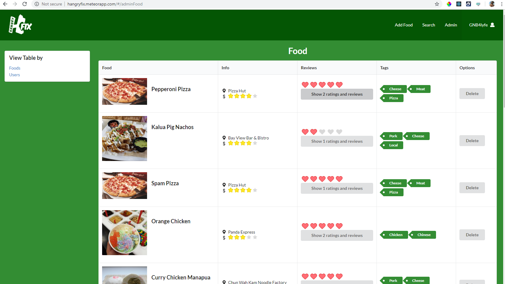

Admin would be able to see all posts and have the rights to delete anything they deem inappropriate.

<a href="http://hangryfix.meteorapp.com/#/admin"><button>Go to page</button></a>
 

<h2 id="installation">Developer Guide</h2>
   1. [Meteor](https://www.meteor.com/install) will need to be installed in order to use this application.
   2. Download a copy of [hangryFIX](https://github.com/hangryfix/hangryfix).
   3. Install the required libraries with `meteor npm install` into the **app** directory of the downloaded digits folder through the command prompt.
   4. Run the application with `meteor npm run start`. 
   Note: on the first run of hangryFIX, default data, such as users and foods, will be created.
   5. The application will then be viewable and usable at [http://localhost:3000/](http://localhost:3000/).
   6. You can also run ESLint for the files in the **imports** directory with `meteor npm run lint`.

<h2 id="developmentHistory">Development History</h2>

<h3 id="milestone1">Milestone 1: Mockup Development</h3>

This milestone started on April 5, 2019 and ended on April 11, 2019. The goal of Milestone 1 was to create pencil-and-paper mockups of the pages on hangryFIX. The landing page layout is based on Grubhub's, and a screenshot of their page was used as the mockup. 
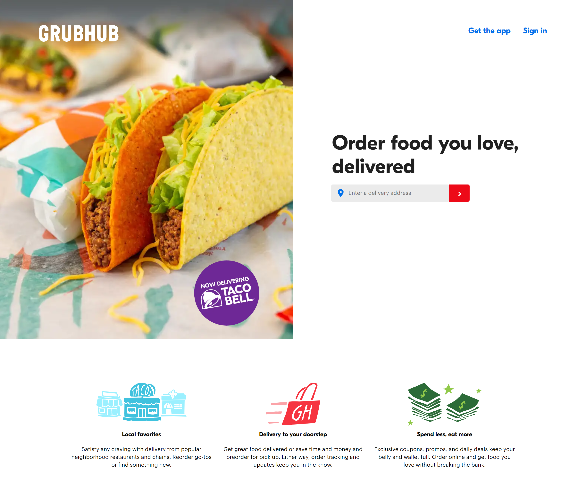

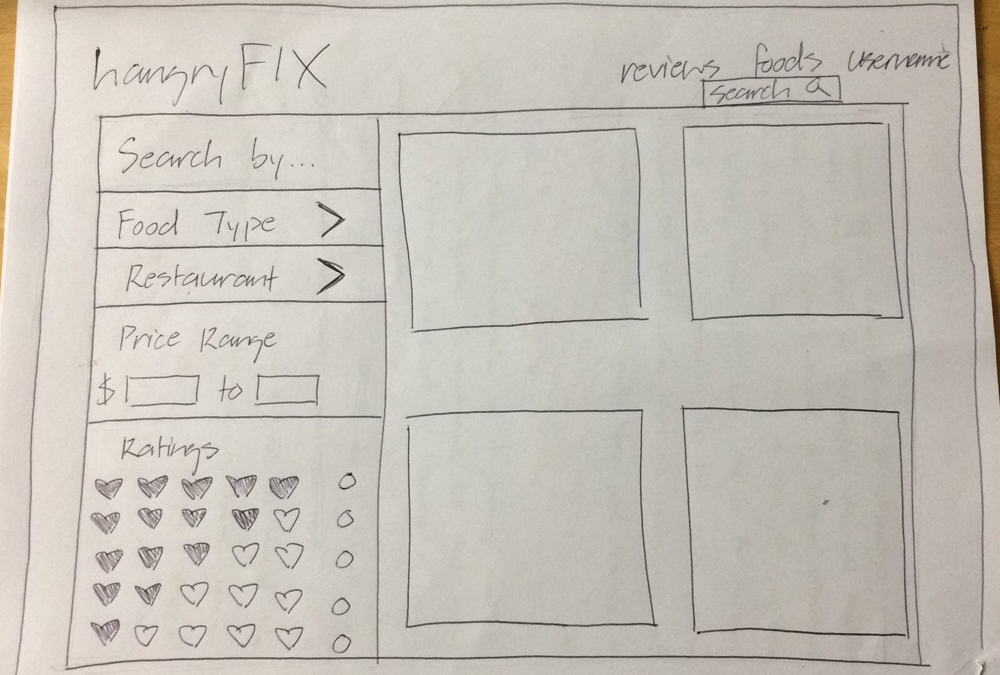
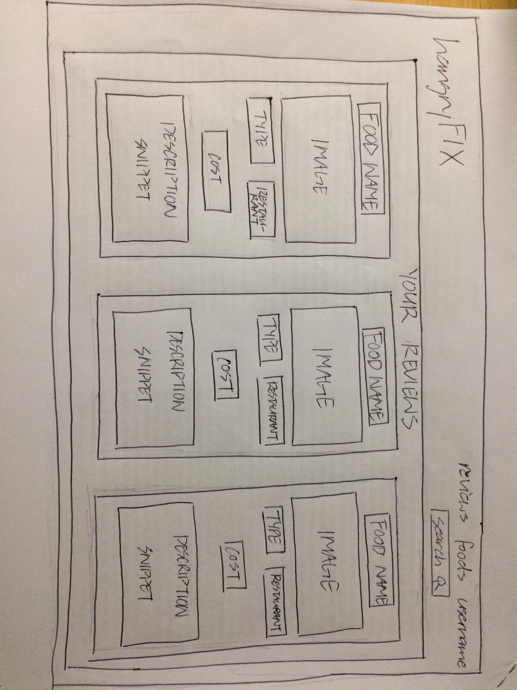 
  
Milestone 1 was implemented as hangryFIX GitHub Milestone M1:
  
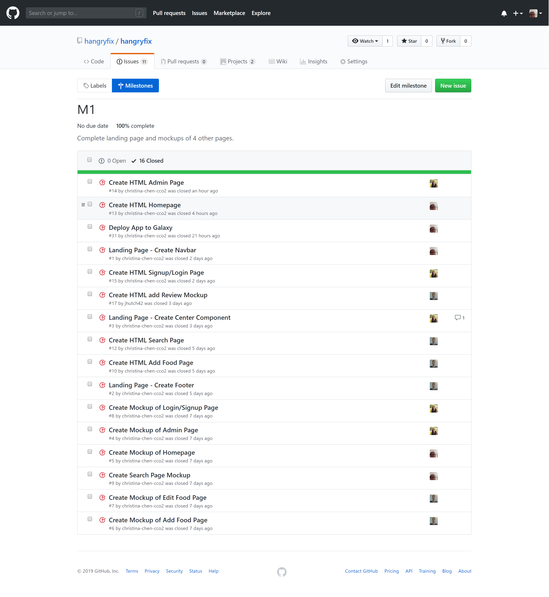
  
Milestone 1 consisted of 16 issues, each of which were implemented in their own branches that were later merged into the master. Progress was managed via the hangryFIX GitHub Project M1:
  
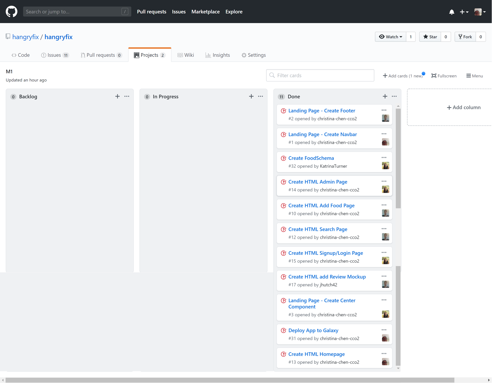

<a href="https://github.com/hangryfix/hangryfix/projects/1"><button>Go to M1 board</button></a>

<h3 id="milestone2">Milestone 2: Functionality</h3>

This milestone started on April 18, 2019 and ended on April 25, 2019. The goal of Milestone 2 was to add the first sets of functionality to the pages and components. The major additions are the ability to add and edit reviews and to add foods. 
 
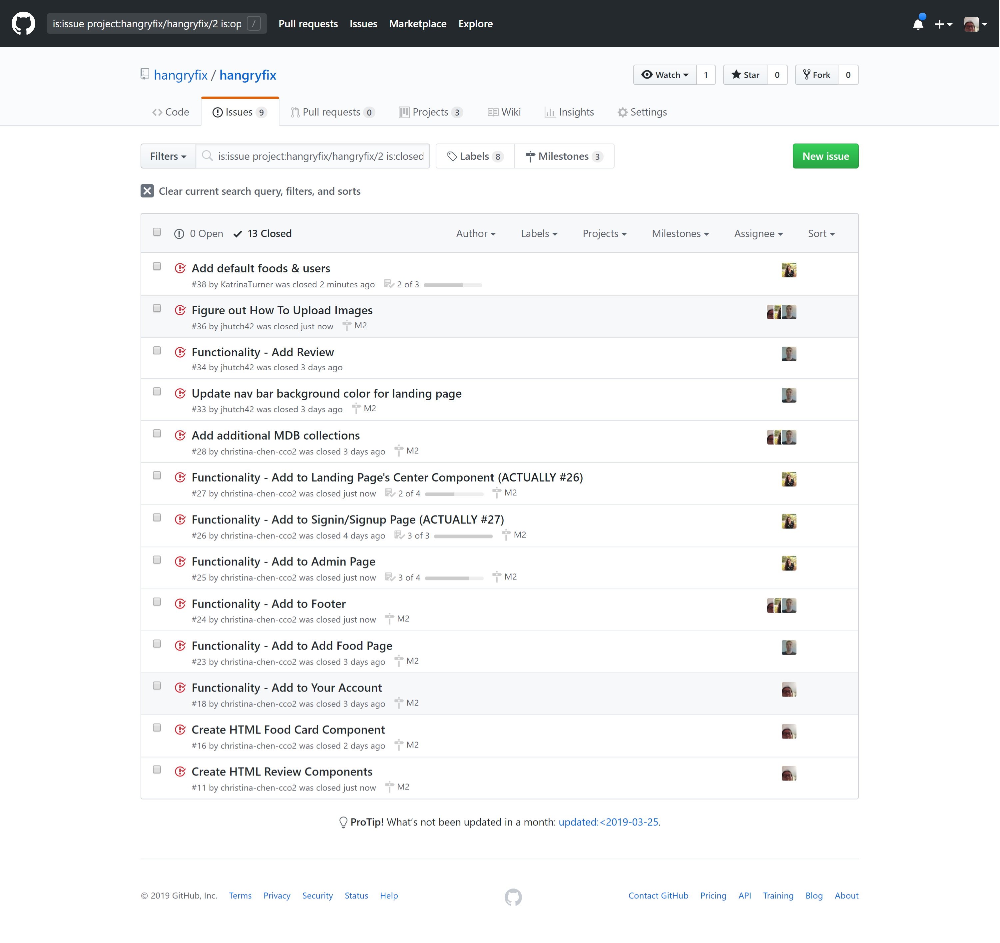
  
Milestone 2 consisted of 13 issues, each of which were implemented in their own branches that were later merged into the master. Progress was managed via the hangryFIX GitHub Project M2:
  
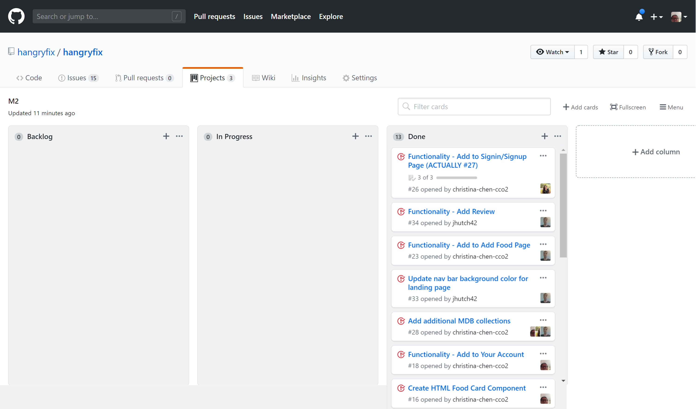

<a href="https://github.com/hangryfix/hangryfix/projects/2"><button>Go to M2 board</button></a>

<h3 id="milestone3">Milestone 3: Improved Functionality</h3>
<a href="https://github.com/hangryfix/hangryfix/projects/4"><button>Go to M3 board</button></a>

<h2 id="theAuthors">The Authors</h2>

Christina Chen James Hutchison Katrina Johnson Turner

