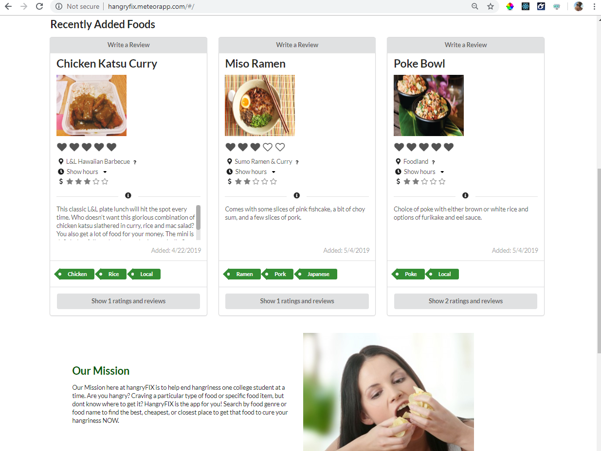
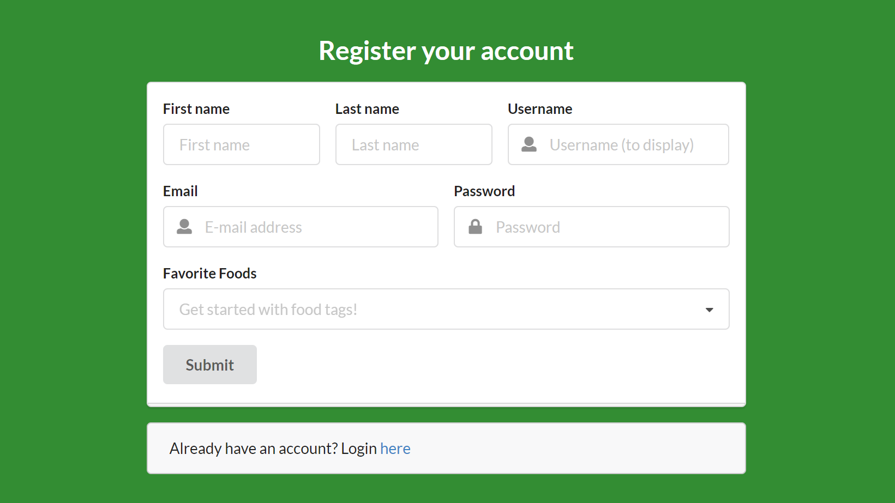
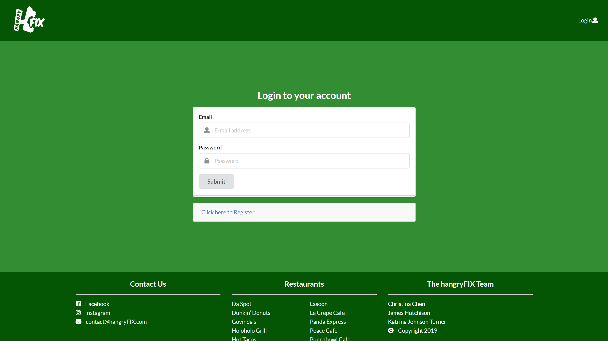
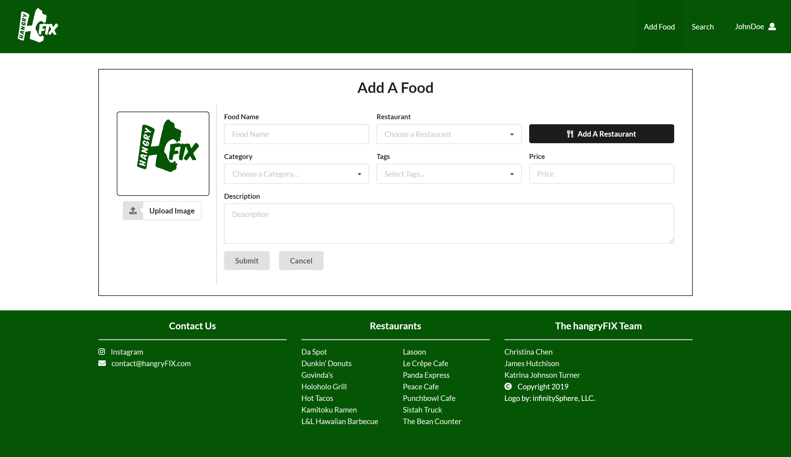
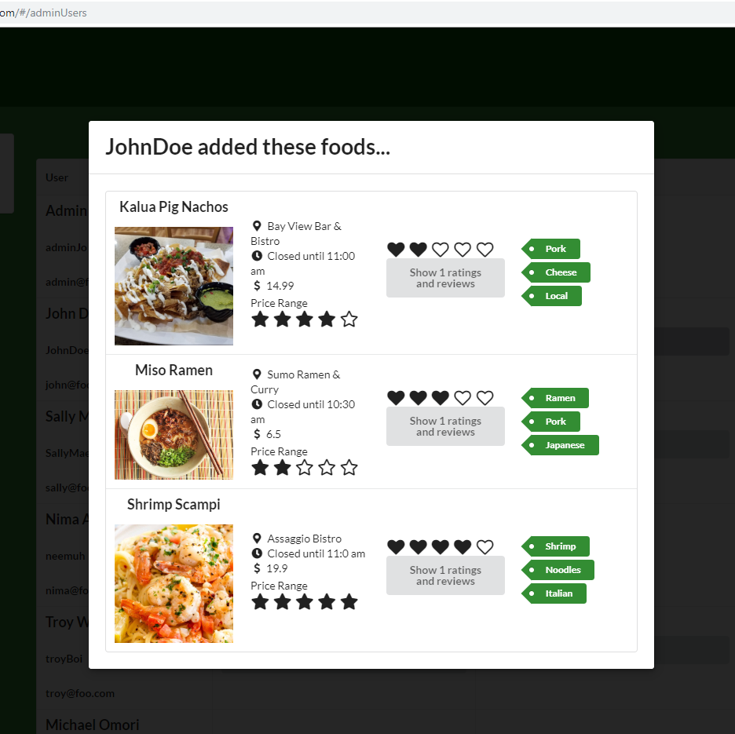
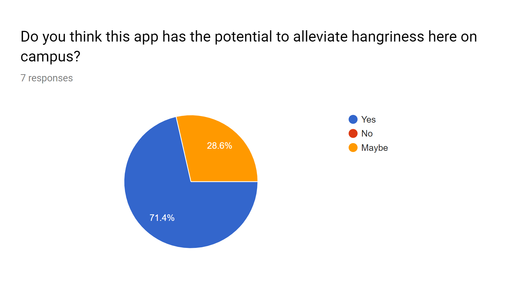
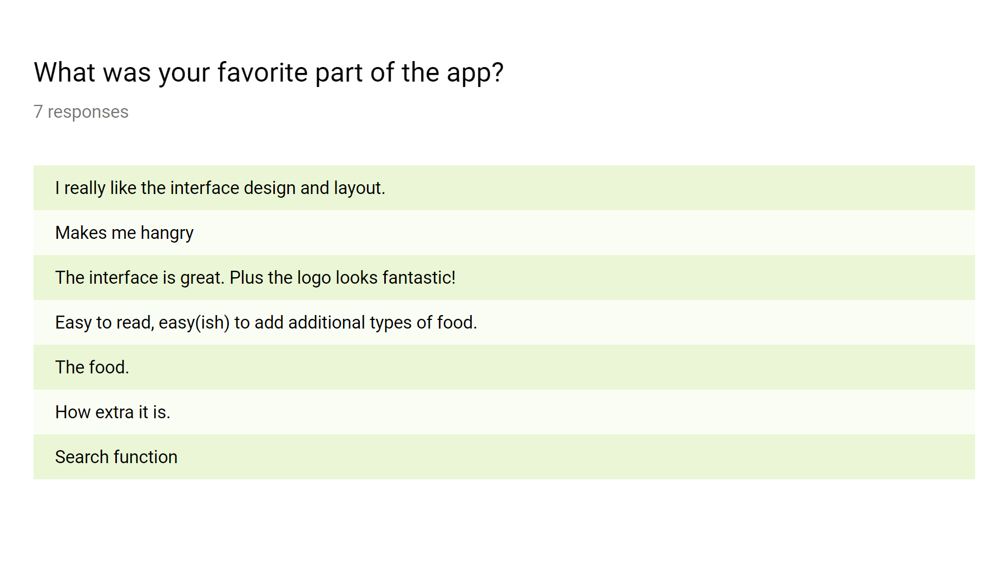

<h2>Table of Contents</h2>
- <a href="#overview">Overview</a>
- <a href="#theApp">The App</a>
  - <a href="#landingPage">Landing Page</a>
  - <a href="#signinPage">Signin Page</a>
  - <a href="#signUpPage">Register Page</a>
  - <a href="#userHomePage">Your Account Page</a>
  - <a href="#searchPage">Search Page</a>
  - <a href="#addFoodPage">Add Food Page</a>
  - <a href="#addingEditingReviews">Adding/Editing Reviews</a>
- <a href="#installation">Developer Guide</a>
- <a href="#developmentHistory">Development History</a>
  - <a href="#milestone1">Milestone 1: Mockup development</a>
  - <a href="#milestone2">Milestone 2: Functionality</a>
  - <a href="#milestone3">Milestone 3: Improved functionality</a>
- <a href="#community">Community Feedback</a>
- <a href="#theAuthors">The Authors</a>

<h2 id="overview">Overview</h2>

There are many restaurant review sites (i.e. Yelp), but students often crave a specific food item rather than a genre or restaurant.

hangryFIX is a way for UHM students to publicize, rate, and search for specific food items. Ratings will revolve around food items rather than overall restaurant quality, service, etc.

<a href="http://hangryfix.meteorapp.com/#/"><button class="overview_app_button">Go to App</button></a>
<a href="https://github.com/hangryfix/hangryfix/projects"><button>Go to Project Board</button></a>
<a href="https://github.com/hangryfix/hangryfix"><button>Go to Source Code</button></a>

 

<h2 id="theApp">User Guide</h2>

<h3 id="landingPage">Landing Page</h3>

The landing page displays the three most recent food items along with their reviews along the purpose and goal--essentially, to prevent hangryness--of this application. Through the navigation bar, users can log in to their accounts and register for one. Any visitor to the site can start searching for foods from the landing page by clicking on the respective icon for a food category they're currently hangry for.

<a href="http://hangryfix.meteorapp.com/#/"><button>Go to page</button></a>
 

<h3 id="signinPage">Signin & Register Pages</h3>

Before users can add foods, leave reviews, and "bookmark" certain foods, they are required to sign in to their accounts or to register for a new one. During registration, they can add tags associated with their favorite foods to help customize their account page. After that, users will need just their email address and password to sign in to their accounts.

<a href="http://hangryfix.meteorapp.com/#/signup"><button>Go to Register page</button></a>    
<a href="http://hangryfix.meteorapp.com/#/signin"><button>Go to Signin page</button></a>

 

<h3 id="userHomePage">Your Account Page</h3>

Users have a personalized page with 3 tabs for easy food finding. The first tab shows the 9 newest foods recently added to the hangryFIX site. The second tab shows new foods associated with the tags they "favorited." And the third tab shows them all their previous reviews so they can easily find those foods again and edit their reviews if they need to.

<a href="http://hangryfix.meteorapp.com/#/yourAccount"><button>Go to page</button></a>
 

<h3 id="searchPage">Search Page</h3>

The search page is one of the most important pages in the application. This page is accessible through the icons provided for each food category on the landing page and through the navigation bar. From here, users can find foods that have been added to the app based on their food categories. They can filter foods by what is most important to them with the options of by rating, price range, and currently open restaurants.

<a href="http://hangryfix.meteorapp.com/#/search"><button>Go to page</button></a>
 

<h3 id="addFoodPage">Add Food Page</h3>

All users with an account can add a new food item to the database. Available information the user can add about that food is name, image by URL, restaurant and its hours, price, and a brief description. If no image URL is provided, the default image of the hangryFIX logo will be featured. Users can also add new restaurants here if they aren't available. In addition, admins are able to view which users added which foods across the site.

<a href="http://hangryfix.meteorapp.com/#/addFood"><button>Go to page</button></a>
 

<h3 id="addingEditingReviews">Adding/Editing Reviews</h3>

Users can add a review for a food item they have eaten before if that has already been added to the database. (Otherwise they need to first add the food).  They can also go back and edit that review at anytime or delete the review. Like when adding foods, 1) if no image URL is provided, the default image of the hangryFIX logo will be featured in the review, and 2) admins are able to view which users wrote which reviews across the site.

<h3 id="adminPage">Admin Page</h3>

Users with Admin rights are able to view all foods and users.  They can delete any foods they deem inappropriate and track what reviews and foods are being added by which users.

<a href="http://hangryfix.meteorapp.com/#/admin"><button>Go to page</button></a>

 

<h2 id="installation">Developer Guide</h2>
   1. [Meteor](https://www.meteor.com/install) will need to be installed in order to use this application.
   2. Download a copy of [hangryFIX](https://github.com/hangryfix/hangryfix).
   3. Install the required libraries with `meteor npm install` into the **app** directory of the downloaded digits folder through the command prompt.
   4. Run the application with `meteor npm run start`. 
   Note: on the first run of hangryFIX, default data, such as users and foods, will be created.
   5. The application will then be viewable and usable at [http://localhost:3000/](http://localhost:3000/).
   6. You can also run ESLint for the files in the **imports** directory with `meteor npm run lint`.

<h2 id="developmentHistory">Development History</h2>

<h3 id="milestone1">Milestone 1: Mockup Development</h3>

This milestone started on April 5, 2019 and ended on April 11, 2019. The goal of Milestone 1 was to create pencil-and-paper mockups of the pages on hangryFIX. The landing page layout is based on Grubhub's, and a screenshot of their page was used as the mockup. 

  
Milestone 1 was implemented as hangryFIX GitHub Milestone M1:
  

  
Milestone 1 consisted of 16 issues, each of which were implemented in their own branches that were later merged into the master. Progress was managed via the hangryFIX GitHub Project M1:
  

<a href="https://github.com/hangryfix/hangryfix/projects/1"><button>Go to M1 board</button></a>

<h3 id="milestone2">Milestone 2: Functionality</h3>

This milestone started on April 18, 2019 and ended on April 25, 2019. The goal of Milestone 2 was to add the first sets of functionality to the pages and components. The major additions and primary focus of this app are the abilities to add, edit, and view reviews and to add and view foods. In addition, nearly all of the MongoDB schemas, such as for foods, users, and reviews, to be used in the app were created in this milestone. Work on creating default data such as foods, restaurants, and user accounts was also started.  
Milestone 2 was implemented as hangryFIX GitHub Milestone M2:
  

  
Milestone 2 consisted of 13 issues, each of which were implemented in their own branches that were later merged into the master. Progress was managed via the hangryFIX GitHub Project M2:
  

<a href="https://github.com/hangryfix/hangryfix/projects/2"><button>Go to M2 board</button></a>

<h3 id="milestone3">Milestone 3: Improved Functionality</h3>

This milestone started on April 25, 2019 and ended on May 6, 2019. The goal of Milestone 3 was to continue and finish adding the functionality needed for this application. The major additions and/or changes made were working filters to the search page and the users' account pages, the feature for users to view all their reviews they made on their account pages, and icons for searching foods in each food category on the landing page. The building of the application wrapped up in this milestone with a few clean-ups of the overall layout of all the pages.  
Milestone 3 was implemented as hangryFIX GitHub Milestone M3:
  

  
Milestone 3 consisted of 13 issues, each of which were implemented in their own branches that were later merged into the master. Progress was managed via the hangryFIX GitHub Project M3:
  

<a href="https://github.com/hangryfix/hangryfix/projects/4"><button>Go to M3 board</button></a>

<h2 id="community">Community Feedback</h2>
We took 5 members of the UH community and asked them to make accounts to test out the prototype of our app.  Overall we got fairly positive responses.  Here are some screenshots of the anonymous post survey we gave them.
 

 
*All respondents said they would use the app a few times a week to a few times a month and most of them said the app has the potential to alleviate hangriness on our campus.*

 
*Here are some of the pros and cons listed by our community members.*

 

 
*Overall, people seemed to like the app.*

<h2 id="theAuthors">The Authors</h2>

<a href="https://christina-chen-cco2.githun.io">Christina Chen</a>
 
<a href="https://jhutch42.github.io">James Hutchison</a>
 
<a href="https://katrinaturner.github.io">Katrina Johnson Turner</a>

